<!-- TOC -->

- [1 前言](#1-前言)
- [2 排序基础](#2-排序基础)
    - [2.1 选择排序](#21-选择排序)
    - [2.2 插入排序](#22-插入排序)
- [3 高级排序算法](#3-高级排序算法)
    - [3.1 归并排序](#31-归并排序)
        - [3.1.1 插入排序与归并排序](#311-插入排序与归并排序)
        - [3.1.2 优化归并排序](#312-优化归并排序)
        - [3.1.3 自底向上的归并排序](#313-自底向上的归并排序)
    - [3.2 快速排序](#32-快速排序)
        - [3.2.2 随机快速排序](#322-随机快速排序)
        - [3.2.3 双路快速排序](#323-双路快速排序)
        - [3.2.4 三路快速排序](#324-三路快速排序)
        - [3.2.5 双轴快速排序DualPivotQuicksort](#325-双轴快速排序dualpivotquicksort)
    - [3.3 分治法](#33-分治法)
    - [3.3 算法稳定性stable](#33-算法稳定性stable)
    - [3.4 Java默认排序原理分析](#34-java默认排序原理分析)
- [4 堆和堆排序](#4-堆和堆排序)
    - [4.1 为什么使用堆](#41-为什么使用堆)
    - [4.2 堆的基本实现](#42-堆的基本实现)
    - [4.3 插入元素 Shift Up](#43-插入元素-shift-up)
    - [4.4 取出元素 Shift Down](#44-取出元素-shift-down)
    - [4.5 基础堆排序](#45-基础堆排序)
    - [4.6 原地堆排序](#46-原地堆排序)
    - [4.7 索引堆](#47-索引堆)
    - [4.8 索引堆的优化](#48-索引堆的优化)
    - [4.9 使用堆解决问题](#49-使用堆解决问题)
    - [4.10 Java中的PriorityQueue](#410-java中的priorityqueue)
    - [4.11 排序算法总结](#411-排序算法总结)
        - [4.11.1 常见排序算法对比](#4111-常见排序算法对比)
        - [4.11.2 快排与归并排序的选择](#4112-快排与归并排序的选择)
        - [4.11.3 自定义比较函数](#4113-自定义比较函数)
        - [4.11.4 assert知识补充](#4114-assert知识补充)
- [待补充](#待补充)
- [5 二分搜索树](#5-二分搜索树)
- [6 并查集](#6-并查集)
- [7 图论](#7-图论)
- [8 最小生成树](#8-最小生成树)
- [9 最短路径](#9-最短路径)
- [参考文档与推荐阅读](#参考文档与推荐阅读)

<!-- /TOC -->

# 1 前言

# 2 排序基础

对于排序算法，最优的时间复杂度是`O(nlogn)`，那为什么要学习`O(n^2)`的排序算法？

1. 因为这些排序算法是最基础的，对于一个问题，我们都要先尝试使用最简单的思路，能够加深我们对于问题的理解，进而提出更加复杂的思路或优化最初的思路。这是一种很好的解决问题的方法。
2. 编码简单，易于实现，在一些场景中，可能`O(n^2)`的排序算法才是首选
3. 在一些特殊情况下，简单的排序算法效率反而更高
4. 简单的排序算法思想能衍生出复杂的排序算法，如希尔排序就是从插入排序演化而来


## 2.1 选择排序

时间复杂度：`O(n^2)`

一句话描述：每次选择出数组乱序部分最小的元素，和乱序部分第一个元素交换

**思路：**

1. `第1次`，找到数组`n`个元素中最小的元素
2. 和数组`第1个`元素交换后，`前1个`元素有序
3. `第 i 次`，找到数组剩下`n-i`个元素中最小的元素
4. 和数组`第 i 个`元素交换后，`前 i 个`元素有序（即放到已排序序列末尾）

动画演示：


```java
// 选择排序
public void selectionSort(int arr[]) {
    if(arr.length < 2) {
        return;
    }
    for(int i=0; i< arr.length; i++) {
        int minIndex = i;
        // 找到剩下n-i个中的最小元素索引, 前i个元素已经排好序了
        // 寻找[i+1, n)区间里的最小值
        for(int j=i+1; j< arr.length; j++) {
            if(arr[j] < arr[minIndex]) {
                minIndex = j;
            }
    	}
        // 最小元素和第i个元素交换
        int temp = arr[i];
        arr[i] = arr[j];
        arr[j] = temp;
     }    
}
```

泛型化的选择排序代码(github.com)


## 2.2 插入排序

时间复杂度：O(n^2)，最差O(n)

一句话描述：摸牌后将新牌**插入**到合适位置的思想就是插入排序


**思路：**

1. `第1个`元素固定不动
2. 将`第2个`元素与`前1个`元素从右到左依次比较交换后，`前2个`元素有序
3. 将`第i个`元素与`前i-1个`元素从右到左依次比较比较交换，`前i个`元素有序

**动画演示：**


```java
public void insertSort(Integer[] arr) {
    if (arr.length < 2) {
        return;
    }

    for (int i = 1; i < arr.length; i++) {

        // 寻找元素arr[i]的插入位置, 类似冒泡的一轮
        // 所以最小到arr[1]与arr[0]比较, j的取值范围[1, i]
        for (int j = i; j > 0; j--) {
            // 和前一个元素作比较, 小于则交换
            if (arr[j] < arr[j - 1]) {
                int temp = arr[j];
                arr[j] = arr[j - 1];
                arr[j - 1] = temp;
            } else {
                // 找到插入位置后退出
                break;
            }
        }
    }
}
```

插入排序优化版

```java
/**
 * 插入排序改进版
 * 不再依次比较交换, 只比较, 然后元素右移, 找到位置后插入元素
 * 相比v1版, 省去了交换中的两次赋值操作
 * @param arr
 */
public void insertSortV2(Integer[] arr) {
    if (arr.length < 2) {
        return;
    }

    for (int i = 1; i < arr.length; i++) {
        int ele = arr[i];

        // 寻找元素arr[i]的插入位置j, 找到后退出循环
        int j;
        // 每个元素和ele比较, 找到位置后退出, j的取值范围[1, i]
        for (j = i; j > 0 && ele < arr[j - 1]; j--) {
            // 若元素小于ele, 则元素右移
            arr[j] = arr[j - 1];
        }
        // 找到插入位置, 插入元素ele
        arr[j] = ele;
    }
}
```

插入排序具体**提前结束**的特性，所以对于**近乎有序**的数据效果非常好，甚至优于`O(nlogn)`算法(如<a href="#insert">归并排序</a>)，对于极端的有序数据，**插入排序**的时间复杂度会降低到`O(n)`。

插入排序也会在更加复杂的排序算法(归并排序, 快速排序)中作为一个<a href="#merge">子过程</a>，来进行优化。

> 实现冒泡排序与希尔排序，并对其优化


# 3 高级排序算法

这一章节主要学习`O(nlogn)`的算法，`O(nlogn)`在10W级别的数据量就能快6000倍。

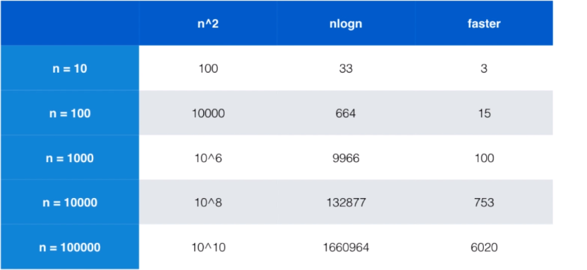

## 3.1 归并排序

一句话描述：

**时间复杂度：**归并排序把n个元素的数组一层一层折半分组，层数就是`logn`，每一层需要归并的元素都为`n个`，所以复杂度为`O(nlogn)`。

**空间复杂度：**`O(n)`

**思路：**

1. 分组：不断将数组从中间切割为两个子序列，直至两个子序列都只有一个元素，一个元素即为有序序列
2. 归并：不断将两个部分合并(merge)，合并过程：
   1. 设定两个指针，最初位置分别为两个有序序列的起始位置；
   2. 比较两个指针所指向的元素，选择相对小的元素放入到合并空间，并移动指针到下一位置
   3. 重复步骤 3 直到某一指针达到序列尾；
   4. 将另一序列剩下的所有元素直接复制到合并序列尾。 此时得到一个有序序列。
   5. 回到上一层继续进行合并merge操作


动画演示：


1. 首先，将数字分割成两片区域
2. 再将数字分割成两片区域，依次划分
3. 直到每片区域只有一个元素，分割完成
4. 接下来，将分割的每片区域进行合并组合
5. 合并时，按照数字的升序移动，使得合并后的数字在组内按升序排列
6. 当合并包含多个数字的组时，比较开头的数字，移动其中较小的数字
7. 比如在动画中，比较开头的 4 和 3
8. 其中 4 大于 3， 因此移动 3
9. 按照同样的逻辑去比较该列剩余的头数
10. 4 小于 7 ，所以移动 4
11. 同样的逻辑去进行接下来的操作
12. 递归的重复组的合并操作，直到所有数字都在一个组中。
13. 完成 归并排序 


**代码示例：**

```java
public void mergeSort(Integer[] arr) {
        if (arr.length < 2) {
            return;
        }

        mergeSort0(arr, 0, arr.length - 1);
    }

    /**
     * 1. 切割阶段
     * 切割后获得两个子序列, 对两个自学列递归使用归并排序, 直至切割至一个元素
     * 然后进行merge操作, 结束后返回到上一层进行merge操作
     *
     * @param arr
     * @param left
     * @param right
     */
    private void mergeSort0(Integer[] arr, Integer left, Integer right) {
        // 递归的退出条件, 当left和right相等时, 即只有一个元素时不再切割
        if (left >= right) {
            return;
        }

        // 对数组分割后继续使用归并排序
        int mid = (left + right) / 2;
        mergeSort0(arr, left, mid);
        mergeSort0(arr, mid + 1, right);

        /* 优化1:
         * 当排序后前半部分最大值大于后半部分最小值时, 才需要merge,
         * 比如{1,3,6,8} arr[mid]小于arr[mid+1]不需要归并
         * 针对近乎有序的用例, 这个判断可以节省非常多的时间
         */
        if (arr[mid] > arr[mid + 1]) {
            merge(arr, left, mid, right);
        }
    }

    /**
     * 2. 归并过程
     * 将切割后的数组arr[l...mid]和arr[mid+1...r]两部分归并
     *
     * @param arr
     * @param left
     * @param mid
     * @param right
     */
    private void merge(Integer[] arr, Integer left, int mid, Integer right) {
        // 拷贝数组arr[l...r], temp长度为r-l+1, arr[l]对应到temp[0]的位置
        Integer[] temp = Arrays.copyOfRange(arr, left, right + 1);

        int p1 = left;      // 切割后第一部分p1的索引
        int p2 = mid + 1;     // 切割后第二部分p2的索引
        // 数组arr[l...mid]和arr[mid+1...r]进行归并
        for (int i = left; i <= right; i++) {
            // 切割后的左半部分p1即arr[l...mid]已经被遍历完
            if (p1 > mid) {
                arr[i] = temp[p2 - left];
                p2++;
                continue;
            }
            // 切割后的右半部分p2即arr[mid+1...r]已经被遍历完, 直接填充p1即可
            if (p2 > right) {
                arr[i] = temp[p1 - left];
                p1++;
                continue;
            }

            // 比较两部分的第一个元素, 小的元素填充到原数组中, 并且索引右移
            if (temp[p1 - left] < temp[p2 - left]) {
                arr[i] = temp[p1 - left];
                p1++;
            } else {
                arr[i] = temp[p2 - left];
                p2++;
            }
        }
    }
```

###3.1.1 插入排序与归并排序

通过前面的学习，我们知道插入排序是`O(n^2)`的算法，而归并排序时`O(nlogn)`的算法，但是在下面的数据近乎有序的情况下，反而插入排序更快。这是因为插入排序有<a name="insert">提前终止</a>的特性，在有序情况下，插入排序会变为`O(n)`的时间复杂度。下面是插入排序与归并排序的对比，在10w数量级，归并排序速度是插入排序的100倍，但是在近乎有序的数据集中，插入排序反而更快。

```java
/**
* 插入排序最好情况即数据有序, 事件复杂度为O(n)
* 对于近似有序的数据, 归并排序反而比插入排序慢一些
* 这也是学习O(n^2)算法的原因所在, 在特殊场景下, O(n^2)算法或许更快
*/
@Test
public void compareMergeAndInsert2() {
    int n = 100000;
    // 把rangeRight替换为5, 重复数值多, 更容易触发插入排序提前终止的特性
    Integer[] array = SortTestHelper.generateNearlyOrderedArray(n, 10);
    Integer[] array2 = Arrays.copyOf(array, n);

    SortTestHelper.Performance insertSort = () -> new  InsertSort().insertSortV2(array2);
    insertSort.testSort("insertSort");

    SortTestHelper.Performance mergeSort = () -> new MergeSort().mergeSort(array);
    mergeSort.testSort("mergeSort");
}	

```


###3.1.2 优化归并排序

在前面的代码中，**优化1**中判断排序后前半部分最大值大于后半部分最小值时, 才需要merge。下面的**优化2**我们使用插入排序为归并排序加速

在小规模数组时，切换到**插入排序**。因为当递归分割到最下面几层的子数组时，子数组的规模已经非常小了，继续递归只会使方法的调用过于频繁，**而对于小数组，插入排序比归并排序更快**。用不同的方法处理小规模问题能改进大多数递归算法的性能，在小规模问题上，插入排序或者选择排序可能比归并排序更快，而且这样做可以有效**减少递归的深度，减少方法调用的开销**。（详细见《算法 4》）

经过实际测试，优化后归并排序的速度更快，对于近乎有序的数据，速度也更接近插入排序

```java
/**
 * 1. 切割阶段
 * 递归使用归并排序, 对数组不断切割至一个元素对arr[l...r]的范围进行排序
 */
private void mergeSort0(Integer[] arr, Integer left, Integer right) {
    // 递归的退出条件, 当left和right相等时, 即只有一个元素时不再切割
    //        if (left >= right) {
    //            return;
    //        }

    /* 优化2:
    * 利用插入排序作为子过程, 优化归并排序
    * 不用分隔为1个元素, 分隔为少量元素时就可以使用插入排序
    */
    if (right - left < 15) {
        InsertSort.sort(arr, left, right);
    }


    // 对数组分割后继续使用归并排序
    int mid = (left + right) / 2;
    mergeSort0(arr, left, mid);
    mergeSort0(arr, mid + 1, right);

    // 当排序后前半部分最大值大于后半部分最小值时, 才需要merge, 比如{1,3,6,8} arr[mid]小于arr[mid+1]不需要归并
    // 针对近乎有序的用例, 这个判断可以节省非常多的时间
    if (arr[mid] > arr[mid + 1]) {
        merge(arr, left, mid, right);
    }
}
```

> 问题：<a name="insertBest">为什么对于小数组，插入排序比归并排序更快</a>？

插入排序最差情况循环次数为1+2+3+ ....n-1 =` n(n-1)/2`，归并排序复杂度`nlog2(n)`，使用[wolframalpha](https://www.wolframalpha.com/input/?i=x*log%28x%29%2Flog%282%29%3Dx*%28x-1%29%2F2)绘制插入排序与归并排序的时间复杂度函数，如下所示

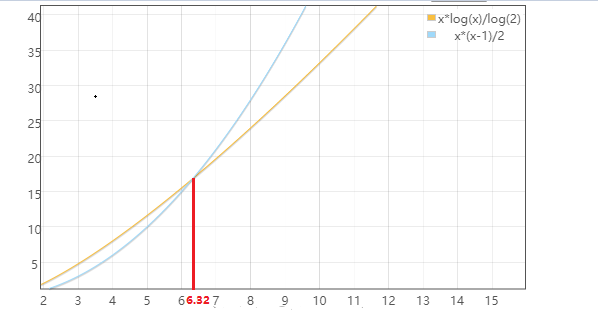

由图可知在数组长度n小于6.32之前，使用插入排序更快，否则使用归并排序更快。再加上归并排序需要递归赋值、拷贝数组等操作更多更消耗性能，而使用插入排序操作更少且具有**提前终止**的特性。

综上所述，在小数组时使用插入排序更快。


> **问题：**在优化2归并排序中，我们选择在数组长度小于16时使用插入排序，那么在完全随机的数中，到底什么样的数字更为合理呢？

查看JDK的Arrays#sort代码，归并排序分割数组至6个元素时，转为使用插入排序，代码如下所示：

```java
private static final int INSERTIONSORT_THRESHOLD = 7;

private static void mergeSort(Object[] src,
                              Object[] dest,
                              int low,
                              int high,
                              int off) {
    int length = high - low;
    
	// 归并排序折半后当数组小于7时,使用插入排序
    // Insertion sort on smallest arrays
    if (length < INSERTIONSORT_THRESHOLD) {
    	// 插入排序
    }
    ......
}
```

通过上面的问题<a href="#insertBest">为什么对于小数组，插入排序比归并排序更快</a>，我们知道当数组长度n<6.32时插入排序更快。

插入排序第一个数据是固定的，最差情况循环次数为1+2+3+ ....n-1 = n * (n-1) / 2，归并排序为n \*（以2为底的log n）。

1. 对于长度为5的数组=>插入排序= 10，合并排序为11.609
2. 对于长度为6的数组=>插入排序= 15，合并排序为15.509
3. 对于长度为7的数组=>插入排序= 21，合并排序为19.651
4. 对于长度为8的数组=>插入排序= 28，合并排序为24

从上面的数据可以清楚地看出，直到长度6，插入排序更快，而在7之后，合并排序是更有效率的。

考虑对长度为8的数组进行排序。除7个合并操作外，合并排序还对自身进行约14次递归调用。每个递归调用都会给运行时带来一些不小的开销。每个合并操作都涉及一个循环，在该循环中必须初始化，递增和比较索引变量，必须复制临时数组，等等。总而言之，可以预料会有300多个“简单”操作。

另一方面，插入排序本质上很简单，并且使用大约8 ^ 2 = 64个运算，这要快得多。

考虑到以上两点，更应该使用略大于6.3的数字。

理论分析还需要实践验证，经过不断修改这个值，发现在10w数据量下，当子序列长度小于` -1`时使用插入排序效果最佳。


这个问题参考了[stackoverflow上Arrays#sort](https://stackoverflow.com/questions/6650048/why-does-java-6-arrayssortobject-change-from-mergesort-to-insertionsort-for)问题的答案。


> **问题：**优化3归并排序是否还有其他方法呢？

参考[归并排序的另外一个优化，在merge外申请aux空间]('https://github.com/liuyubobobo/Play-with-Algorithms/blob/master/03-Sorting-Advance/Course%20Code%20(Java)/Optional-01-Merge-Sort-Create-aux-Array-Out-of-Merge/src/bobo/algo/MergeSort2.java')，这种优化方式在java默认排序中也进行了使用

```java
// Arrays.sort()源码
private static <T> void legacyMergeSort(T[] a, Comparator<? super T> c) {
    // 在merge外申请aux空间，参考优化3
    T[] aux = a.clone();
    if (c==null)
        mergeSort(aux, a, 0, a.length, 0);
    else
        mergeSort(aux, a, 0, a.length, 0, c);
}

// 归并排序
private static void mergeSort(Object[] src,
                              Object[] dest,
                              int low,
                              int high,
                              int off) {
    int length = high - low;

    // Insertion sort on smallest arrays
    // 当数组折半后小于7时使用插入排序，参考优化2
    if (length < INSERTIONSORT_THRESHOLD) {
        for (int i=low; i<high; i++)
            for (int j=i; j>low &&
                 ((Comparable) dest[j-1]).compareTo(dest[j])>0; j--)
                swap(dest, j, j-1);
        return;
    }

    // Recursively sort halves of dest into src
    int destLow  = low;
    int destHigh = high;
    low  += off;
    high += off;
    int mid = (low + high) >>> 1;
    mergeSort(dest, src, low, mid, -off);
    mergeSort(dest, src, mid, high, -off);

    // If list is already sorted, just copy from src to dest.  This is an
    // optimization that results in faster sorts for nearly ordered lists.
    // 如果数组左半部分完全小于右半部分, 直接拷贝即可, 不需要归并，参考优化1
    if (((Comparable)src[mid-1]).compareTo(src[mid]) <= 0) {
        System.arraycopy(src, low, dest, destLow, length);
        return;
    }

    // Merge sorted halves (now in src) into dest
    // 对数组进行归并merge
    for(int i = destLow, p = low, q = mid; i < destHigh; i++) {
        if (q >= high || p < mid && ((Comparable)src[p]).compareTo(src[q])<=0)
            dest[i] = src[p++];
        else
            dest[i] = src[q++];
    }
}
```


###3.1.3 自底向上的归并排序


## 3.2 快速排序

一句话描述：**挖坑填数 + 分治法**。

思路：

1. 将数组第一个元素作为基准值（pivot）

2. 对数组重新排序，小于基准的元素放在左边，大于基准的元素放在右边。即分区（partition）操作：

   1. 设置三个指针，left指向第一个元素基准值pivot，mid指向左分区最后一个元素，i指向右分区最后一个元素
   2. 所以左分区范围为arr[left+1...mid]，右分区范围为arr[mid+1... i]
   3. 遍历元素，若元素小于基准，则与右分区第一个元素arr[mid+1]交换，mid加1，i加1
   4. 若元素大于基准，则扩大右分区范围i加1；
   5. 遍历完成后，基准值arr[left]与左分区最后一个元素arr[mid]交换，
   6. 此时左分区全部小于基准，右分区全部大于基准值

3. 对上一步形成的两个分区继续1，2操作，直至每个分区只有一个元素（递归退出条件）


动画描述：


1. 首先，操作数列中的所有数字
2. 在所有数字中选择一个数字作为排序的基准（pivot）, pivot 通常是随机选择的，在这里为了演示方便，我们选择最右边的数字作为 pivot
3. 选取好 pivot 后，在操作数列中选择最左边的数字标记为 左标记 ，最右边的数字标记为 右标记
4. 将左边的标记向右移动
5. 当 左标记 达到超过 pivot 的数字时，停止移动
6. 在这里，8 > 6 ,所以停止移动
7. 然后将右边的标记向左移动
8. 当 右标记 达到小于 pivot 的数字时，停止移动
9. 在这里，4 < 6 ,所以停止移动
10. 当左右标记停止时，更改标记的数字
11. 因此，左标记 的作用是找到一个大于 pivot 的数字，右标记 的作用是找到一个小于 pivot 的数字
12. 通过交换数字，可以在数列的左边收集小于 pivot 的数字集合，右边收集大于 pivot 的数字集合
13. 交换之后，继续移动 左标记
14. 在这里，9 > 6 ,所以停止移动
15. 然后将右边的标记向左移动
16. 当 右标记 碰撞到 左标记 时也停止移动
17. 如果左右侧的标记停止时，并且都在同一个位置，将这个数字和 pivot 的数字交换
18. 这就完成了第一次操作
19. 小于 6 的都在 6 的左侧，大于 6 的都在 6 的右侧
20. 然后递归对这分成的两部分都执行同样的操作
21. 完成 快速排序

代码示例：

```java
public void quickSort(Integer[] arr) {
        if (arr.length < 2) {
            return;
        }
        quickSort0(arr, 0, arr.length - 1);
    }

    /**
     * 对数组arr[left...right]部分进行排序
     * 进行分区后, 对两个子序列分别使用快排, 直至每个分区只有一个元素
     *
     * @param arr
     * @param left
     * @param right
     */
    private void quickSort0(Integer[] arr, int left, int right) {
/*        // 递归退出条件, 当left和right相等时, 即只有一个元素时不再分区
        if (left >= right) {
            return;
        }*/

        // 优化1: 使用插入排序对快速排序加速,
        // 递归退出条件: 子序列常小于15时不再分区
        if(right - left < 15) {
            InsertSort.sort(arr, left, right);
            return;
        }

        // 对数组进行分区操作
        int privot = partition(arr, left, right);

        quickSort0(arr, left, privot);
        quickSort0(arr, privot + 1, right);
    }

    /**
     * 分区操作
     *
     * @param arr
     * @param left
     * @param right
     * @return
     */
    private int partition(Integer[] arr, int left, int right) {
        // 第一个元素作为基准值
        int privot = arr[left];

        // 分区索引,arr[left+1...mid]都小于基准值, [mid+1...i]都大于基准值
        int mid = left;    // 此时左分区arr[left+1...left]不存在

        // 每遍历一个元素, 右分区范围加1
        for (int i = left + 1; i <= right; i++) {
            if (arr[i] < privot) {
                // 小于基准值属于左分区, 与右分区第一个元素交换位置, 左分区范围+1
                // 当然右分区范围也需要+1
                swap(arr, i, mid + 1);
                mid++;
                // swap(arr[right], arr[++mid]);
            }
        }
        // 基准值与左分区最后一个元素交换
        arr[left] = arr[mid];
        arr[mid] = privot;
        return mid;
    }

    // 不能定义位swap(int a, int b) java不支持引用传递
    private void swap(Integer[] arr, int a, int b) {
        int temp = arr[a];
        arr[a] = arr[b];
        arr[b] = temp;
    }
```


对于乱序数组，快排优于归并排序，10w数据能快40%左右，但是对于近乎有序的数据，快排表现的非常差，耗时甚至达到了归并排序的500倍，同样都是`O(nlogn)`级别的算法，为什么会差距如此之大呢？

因为对于归并排序，每次都是折半分割数组，递归深度稳定在`n(logn)`级别，而快速排序，依赖基准数，对于近乎有序的数据，肯定左分区数据少，右分区数据多。对于极限的有序数组，快速排序的深度会达到n级别，事件复杂度退化到最差情况`O(n^2)`级别，甚至还有可能出现栈溢出异常。

### 3.2.2 随机快速排序

快速排序事件复杂度退化到O(n^2) 级别是因为使用第一个元素作为基准值，而恰好第一个元素是最小值。为了解决这个问题，**我们随机选择一个元素作为基准值pivot**，这样大大降低了快排退化的概率。第一次分区，随机选到最小值的概率是1/n，第二次分区，随机选到最小值的概率是1/n-1，依次类推，使用随机基准值，大数组使用快排退化到O(n^2) 的概率几乎为0。

```java
private int partition(Integer[] arr, int left, int right) {
    // 优化2: 随机选择一个元素作为基准值, 与第一个元素交换, 就可以复用之前的代码了
    swap(arr, left, random.nextInt(right - left + 1) + left);

    int privot = arr[left];

    // 分区索引,arr[left+1...mid]都小于基准值, [mid+1...i]都大于基准值
    int mid = left;    // 此时左分区arr[left+1...left]不存在

    // 每遍历一个元素, 右分区右边界[mid+1...i]加1
    for (int i = left + 1; i <= right; i++) {
        if (arr[i] < privot) {
            // 小于基准值属于左分区, 与右分区第一个元素交换位置, 左分区[left+1...mid]范围+1
            swap(arr, i, mid + 1);
            mid++;
            // swap(arr[right], arr[++mid]);
        }
    }
    // 基准值与左分区最后一个元素交换
    arr[left] = arr[mid];
    arr[mid] = privot;
    return mid;
}
```

随机快排仍然存在一个问题，对于取值范围极小的数据，因为元素与基准值相等的概率极高，相等的元素会出现在同一分区，依然会出现左右分区不平衡的问题。对于极端的元素全部相同的数组，快排分区深度依然会退化到n， 时间复杂度退化到`O(n^2)`，甚至出现栈溢出异常。

###3.2.3 双路快速排序

随机快排时间复杂度退化到`O(n^2)`的原因是有两个分区，与基准值相等的元素必然全部分到一个区中。为了解决这个问题，我们使用双路快排，将分区操作修改如下：

1. 对随机快排优化, 设置两个指针i,j, 分别从数组两端相向而行,

2. 遍历左端元素, 小于基准值, i++, 大于基准值则停止; （思考一下可以小于等于基准值吗？）

3. 遍历右端元素, 大于基准值, j++, 小于基准值则停止;

4. 交换两个元素, 继续遍历左端与右端元素

这样，对于元素完全相同的数组，也能保证元素均匀的分布在两个分区。

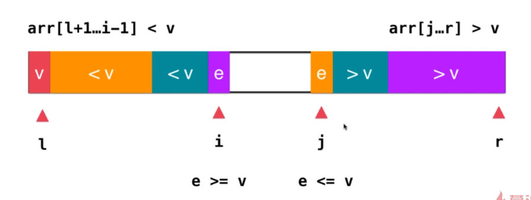

```java
private int partition(Integer[] arr, int left, int right) {
    // 优化2: 随机选择一个元素作为基准值, 与第一个元素交换, 就可以复用之前的代码了
    swap(arr, left, random.nextInt(right - left + 1) + left);
    int privot = arr[left];

    // 1. 设置两个指针, 分别从数组左右两端出发, 左分区[left+1...i) 右分区(j...right]
    int i = left + 1;
    int j = right;

    while (true) {
        /* 思考一下, 为什么是arr[i] < privot而不是arr[i] <= privot, <=不是正好避免了两边都等于基准值时做无效交换吗?
         *
         * 如果元素和基准值都是1, 使用arr[i] <= privot,
         * 下面的while循环是先移动左分区的指针,会让数据全部成为左分区
         * 等到第二个while循环, 已经没有元素. 交换基准值与arr[j]后右分区只有一个元素
         * 最后左右分区不平衡
         *
         * 如果元素和基准值都是1, 如果使用arr[i] < privot,
         * 下面的while循环是先移动左分区的指针,遇到相等的元素, 跳出循环,
         * 第二个while循环是先移动右分区的指针,遇到相等的元素, 跳出循环
         * 然后交换两个相等的元素, 这样相等的元素就能均衡分布在两个分区
         *
         */

        // 2.当遍历左端的元素小于基准值, 扩大左分区范围i++  左分区[left+1...i)
        while (i <= right && arr[i] < privot) i++;
        // 3.当遍历左端的元素大于基准值, 扩大右分区范围j--  右分区(j...right]
        while (j >= left + 1 && arr[j] > privot) j--;

        // 大循环退出条件, i和j已经碰面了
        if (i > j) break;

        // 4.交换两个元素,
        swap(arr, i, j);
        i++;
        j--;
    }

    // 交换基准值arr[left]
    swap(arr, left, j);
    return j;
}
```


### 3.2.4 三路快速排序


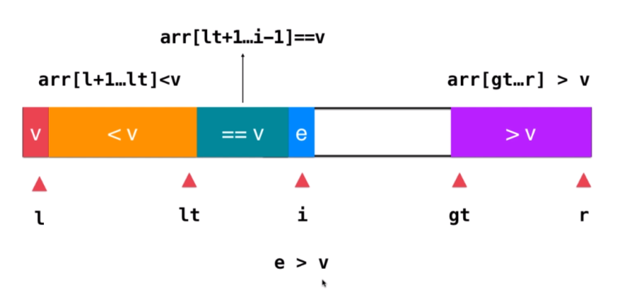

```java
private void quickSort0(Integer[] arr, int left, int right) {
    // 优化1: 使用插入排序对快速排序加速,
    // 递归退出条件: 子序列常小于15时不再分区
    if (right - left < 15) {
        InsertSort.sort(arr, left, right);
        return;
    }

    // Partitioning 对数组进行分区操作
    /*
     * Partitioning:
     *
     *   left part           center part                   right part
     * +--------------------------------------------------------------+
     * |  < pivot     |             == pivot   |    ?    |  > pivot   |
     * +--------------------------------------------------------------+
     * ^             ^                          ^         ^           ^
     * |             |                          |         |           |
     *left          lt                          i         gt        right
     *
     */

    // 优化2: 随机选择一个元素作为基准值
    swap(arr, left, random.nextInt(right - left + 1) + left);
    int privot = arr[left];

    // 设置两个指针, 分别从数组左右两端出发, 左分区[left+1...i) 右分区(j...right]
    int lt = left;      // arr[left+1...lt]<privot   左分区 less than
    int i = left + 1;   // arr[lt+1...i)==privot  中分区, i是正在遍历的元素, 不放在中分区
    int gt = right + 1;   // arr[gt...right]>privot   右分区 greater than

    while (i < gt) {
        // 小于基准值, 左分区, 与中分区第一个元素arr[lt + 1]交换
        // 左分区右边界lt右移, 中分区右边界右移
        if (arr[i] < privot) {
            swap(arr, i, lt + 1);
            lt++;
            i++;
        } else if(arr[i] > privot) {
            // 大于基准值, 属于右分区, 与中分区最后一个元素arr[gt-1]交换
            // 右分区左边界gt左移, 中分区左边界不变, 新的i元素需要判断
            swap(arr, i, gt-1);
            gt--;
        }else {
            // 等于基准值, 属于中分区, 中分区右边界i右移
            i++;
        }
    }

    // 交换基准值与左分区最后一个元素arr[lt], 左分区右边界lt左移
    swap(arr, left, lt);
    lt--;

    // 对左分区进行三路快排
    quickSort0(arr, left, lt);
    // 对右分区进行三路快排
    quickSort0(arr, gt, right);
}

```


###3.2.5 双轴快速排序DualPivotQuicksort

双轴快速排序设置两个基准值(轴)来进行比较，该算法由Vladimir Yaroslavskiy在2009年提出，并于2011年发布在了Java1.7中。阅读Vladimir Yaroslavskiy的[论文](https://codeblab.com/wp-content/uploads/2009/09/DualPivotQuicksort.pdf)可以知道双轴快排分为以下步骤：

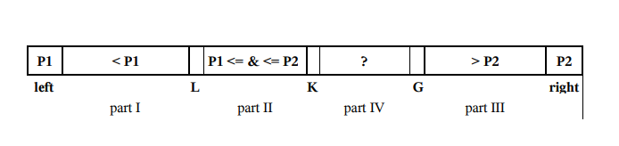

1. 对于小数组（长度<27），请使用插入排序算法。
2. 选择两个基准值(轴)元素P1和P2。例如，我们可以获得第一个元素 arr[left] 作为P1，最后一个元素 arr[right]作为P2。
3. P1必须小于P2，否则将被交换。因此，包含以下部分：

  - 第一部分的索引从 left+1 到 L–1，且元素小于P1。`part1=arr[left+1...L-1] `
  - 第二部分的索引从 L 到 K–1，且元素大于等于P1并且小于等于P2。`part2=arr[L...K-1] `
  - 第三部分的索引从 G+1 到 right-1，元素大于P2。` part3=arr[G+1...right-1]`
  - 第四部分包含要检查的其余元素，其索引从 K 到 G。`part4=arr[K...G]`
4. 将part IV 中的下一个元素arr[K]与两个基准值P1和P2进行比较，并放在相应的 I，II 或 III 部分。
    - arr[k] < p1; swap(arr[k++], arr[L++])
    - arr[k] < p2; k++
    - arr[k] > p2; swap(arr[k++], arr[G--])
5. 指针 L，K 和 G 在相应的方向上改变。
6. 当 K≤G 时，重复步骤4-5。
7. 轴元素 P1 与 partI 中的最后一个元素交换，轴元素 P2 与 partIII 中的第一个元素交换。
8. 对于 part I，part II 和 partIII部分，递归重复步骤1-7。

代码示例：

```java
//对外公开的sort方法
public static void sort(int[] a) {
	sort(a, 0, a.length);
}
public static void sort(int[] a, int fromIndex, int toIndex) {
	rangeCheck(a.length, fromIndex, toIndex);
	dualPivotQuicksort(a, fromIndex, toIndex - 1, 3);
}
//对数组的边界检测
private static void rangeCheck(int length, int fromIndex, int toIndex) {
	if (fromIndex > toIndex) {
		throw new IllegalArgumentException("fromIndex > toIndex");
	}
	if (fromIndex < 0) {
		throw new ArrayIndexOutOfBoundsException(fromIndex);
	}
	if (toIndex > length) {
		throw new ArrayIndexOutOfBoundsException(toIndex);
	}
}
//交换数组中两个元素
private static void swap(int[] a, int i, int j) {
	int temp = a[i];
	a[i] = a[j];
	a[j] = temp;
}
/**
 * 双轴快排的具体实现
 * @param a     待排序数组
 * @param left  数组需排序上界
 * @param right 数组需排序下界
 * @param div   理解为从何位置取轴
 */
private static void dualPivotQuicksort(int[] a, int left,int right, int div) {
	int len = right - left;
	//数组长度如果很小（27），则直接用插入排序对其排序
	if (len < 27) {
		for (int i = left + 1; i <= right; i++) {
			for (int j = i; j > left && a[j] < a[j - 1]; j--) {
				swap(a, j, j - 1);
			}
		}
		return;
	}
	//取到位于1/div和div-1/div位置的点，并用他们来做轴
	int third = len / div;
	int m1 = left + third;
	int m2 = right - third;
	if (m1 <= left) {
		m1 = left + 1;
	}
	if (m2 >= right) {
		m2 = right - 1;
	}
	//确保left是小的，right是大的
	if (a[m1] < a[m2]) {
		swap(a, m1, left);
		swap(a, m2, right);
	}
	else {
		swap(a, m1, right);
		swap(a, m2, left);
	}
	// 两个轴
	int pivot1 = a[left];
	int pivot2 = a[right];
	// 代表比p1小和比p2大的两个指针
	int less = left + 1;
	int great = right - 1;
	// 开始取出less到great之间的未知大小数据，与两个轴比较
	// 并且将数据放入正确的区域后调整各个指针
	for (int k = less; k <= great; k++) {
		//如果取出的数比p1小，那么直接到less左侧，并且less右移
		if (a[k] < pivot1) {
			swap(a, k, less++);
		} 
		//如果取出的数比p2大，那么首先确定great左侧没有比p2大的数
		//然后与great位置的数字交换，great左移
		//此时，great交换的数字肯定是比p2小或者相等的（首先确定过）
		//那么此时再与p1相比，处理这个数的区间
		else if (a[k] > pivot2) {
			while (k < great && a[great] > pivot2) {
				great--;
			}
			swap(a, k, great--);
			if (a[k] < pivot1) {
				swap(a, k, less++);
			}
		}
		//如果这个数比p1大但是比p2小，则不需要交换，只需将k指针右移
	}
	//将p1与less左侧的第一个数交换
	swap(a, less - 1, left);
	//将p2与great右侧的第一个数交换
	swap(a, great + 1, right);
	// 计算出在两轴大小之间的个数
	int dist = great - less;
	//如果这个数很小（13），那么取轴的点向两边偏
	if (dist < 13) {
		div++;
	}
	// 对三个子区间分别排序，因为less-1和great+1是轴，已经排好了序
	// 所以不需要比较
	dualPivotQuicksort(a, left, less - 2, div);
	dualPivotQuicksort(a, great + 2, right, div);
	// 如果在中间区间的数字很多，那么排除掉一些相等的元素再进行排序
	if (dist > len - 13 && pivot1 != pivot2) {
		for (int k = less; k <= great; k++) {
			if (a[k] == pivot1) {
				swap(a, k, less++);
			}
			else if (a[k] == pivot2) {
				swap(a, k, great--);
				if (a[k] == pivot1) {
					swap(a, k, less++);
				}
			}
		}
	}
	// 对中间的区间排序
	if (pivot1 < pivot2) {
		dualPivotQuicksort(a, less, great, div);
	}
}

// 原文链接：https://blog.csdn.net/xjyzxx/article/details/18465661
```


Java中的DualPivotQuickSort类的源码分析和注释可以参考[《双轴快排源码笔记》](https://www.jianshu.com/p/6d26d525bb96)，内容过长就不在这里摘抄了。


##3.3 分治法


> 问题：有序数组使用快排会造成栈溢出异常？

因为每次分区左分区都没有元素，所以有n个元素，就需要递归n次，栈的深度就为n，数组过大就会导致栈溢出。

在Arrays#sort中int数组使用快速排序，如果数据小于`QUICKSORT_THRESHOLD = 286`，则直接使用快排，否则需要判断数据是否近似有序，如果不是近似有序使用快排，否则使用归并排序。

```java
// 双周快排DualPivotQuicksort.java代码
static void sort(int[] a, int left, int right,
                 int[] work, int workBase, int workLen) {
    // 286以下的小数组直接使用快排
    // Use Quicksort on small arrays
    if (right - left < QUICKSORT_THRESHOLD) {
        sort(a, left, right, true);
        return;
    }

   /*
    * Index run[i] is the start of i-th run
    * (ascending or descending sequence).
    */
    int[] run = new int[MAX_RUN_COUNT + 1];
    int count = 0; run[0] = left;

    // 检查数组是否近似有序
    // Check if the array is nearly sorted
    for (int k = left; k < right; run[count] = k) {
        if (a[k] < a[k + 1]) { // ascending 数组是否为升序
            while (++k <= right && a[k - 1] <= a[k]);
        } else if (a[k] > a[k + 1]) { // descending 数组是否为降序
            while (++k <= right && a[k - 1] >= a[k]);
            for (int lo = run[count] - 1, hi = k; ++lo < --hi; ) {
                int t = a[lo]; a[lo] = a[hi]; a[hi] = t;
            }
        } else { // equal
            for (int m = MAX_RUN_LENGTH; ++k <= right && a[k - 1] == a[k]; ) {
                if (--m == 0) {
                    sort(a, left, right, true);
                    return;
                }
            }
        }

       /*
        * The array is not highly structured,
        * use Quicksort instead of merge sort.
        */
        if (++count == MAX_RUN_COUNT) {
            sort(a, left, right, true);
            return;
        }
    }

    // Check special cases
    // Implementation note: variable "right" is increased by 1.
    if (run[count] == right++) { // The last run contains one element
        run[++count] = right;
    } else if (count == 1) { // The array is already sorted
        return;
    }

    // Determine alternation base for merge
    ......
}
```


##3.3 算法稳定性stable

排序算法的稳定性仅仅用执行效率和内存消耗来衡量排序算法的好坏是不够的。针对排序算法，我们还有一个重要的度量指标，**稳定性**。这个概念是说，如果待排序的序列中存在值相等的元素，经过排序之后，相等元素之间原有的先后顺序不变。

我通过一个例子来解释一下。比如我们有一组数据 2，9，3，4，8，3，按照大小排序之后就是 2，3，3，4，8，9。

这组数据里有两个 3。经过某种排序算法排序之后，如果两个 3 的前后顺序没有改变，那我们就把这种排序算法叫作**稳定的排序算法**；如果前后顺序发生变化，那对应的排序算法就叫作**不稳定的排序算法**。

你可能要问了，两个 3 哪个在前，哪个在后有什么关系啊，稳不稳定又有什么关系呢？为什么要考察排序算法的稳定性呢？

很多数据结构和算法课程，在讲排序的时候，都是用整数来举例，但在真正软件开发中，我们要排序的往往不是单纯的整数，而是一组对象，我们需要按照对象的某个 key 来排序。

比如说，我们现在要给电商交易系统中的“订单”排序。订单有两个属性，一个是下单时间，另一个是订单金额。如果我们现在有 10 万条订单数据，我们希望按照金额从小到大对订单数据排序。对于金额相同的订单，我们希望按照下单时间从早到晚有序。对于这样一个排序需求，我们怎么来做呢？

最先想到的方法是：我们先按照金额对订单数据进行排序，然后，再遍历排序之后的订单数据，对于每个金额相同的小区间再按照下单时间排序。这种排序思路理解起来不难，但是实现起来会很复杂。

借助稳定排序算法，这个问题可以非常简洁地解决。解决思路是这样的：我们先按照下单时间给订单排序，注意是按照下单时间，不是金额。排序完成之后，我们用稳定排序算法，按照订单金额重新排序。两遍排序之后，我们得到的订单数据就是按照金额从小到大排序，金额相同的订单按照下单时间从早到晚排序的。为什么呢？

**稳定排序算法可以保持金额相同的两个对象，在排序之后的前后顺序不变**。第一次排序之后，所有的订单按照下单时间从早到晚有序了。在第二次排序中，我们用的是稳定的排序算法，所以经过第二次排序之后，相同金额的订单仍然保持下单时间从早到晚有序。


##3.4 Java默认排序原理分析

参考极客时间工业级排序

Timsort


```java
// int[]数组使用双轴快排
public static void sort(int[] a) {
    DualPivotQuicksort.sort(a, 0, a.length - 1, null, 0, 0);
}

public static void sort(Object[] a) {
    if (LegacyMergeSort.userRequested)
        legacyMergeSort(a);
    else
        ComparableTimSort.sort(a, 0, a.length, null, 0, 0);
}

public static <T> void sort(T[] a, Comparator<? super T> c) {
    if (c == null) {
        sort(a);
    } else {
        if (LegacyMergeSort.userRequested)
            legacyMergeSort(a, c);
        else
            TimSort.sort(a, 0, a.length, c, null, 0, 0);
    }
}

```

> 问题: 为什么int[]数组使用双轴快速排序，而对象数组反而使用归并排序或Timsort?

1. 内存敏感：使用原始类型int说明对内存敏感，所以使用快排，归并需要占用额外空间。
2. 稳定性：排序对象数据时，稳定性很重要

对于原始类型，稳定性不是问题，因为没有与（值）相等不同的身份概念。快排不提供稳定排序，但是，当按原始值的自然顺序对原始值进行排序时，您不会注意到差异，因为原始值没有身份。因此，快排可以用于原始数组。

排序任意对象时，稳定性至关重要。例如，假设您有代表电子邮件消息的对象，然后先按日期对它们进行排序，然后再按发件人对它们进行排序。您希望它们在每个发件人中都按日期排序，但是只有在排序稳定的情况下才是正确的。这就是为什么我们选择提供一个稳定的排序（合并排序）来对对象引用进行排序的原因。（从技术上讲，多个顺序稳定排序会导致键的字典顺序以排序的相反顺序进行：最终排序确定最高有效的子键。）

https://stackoverflow.com/questions/15154158/why-collections-sort-uses-merge-sort-instead-of-quicksort

https://stackoverflow.com/questions/32334319/why-does-collections-sort-use-mergesort-but-arrays-sort-does-not?noredirect=1&lq=1

# 4 堆和堆排序

##4.1 为什么使用堆

普通队列：先进先出

优先队列：优先级高的先出，先进的不一定先出。

优先队列类似看病排队，病急患者后来可先看医生。在游戏中可能也会使用到优先队列，比如周围有多个敌人，释放技能会瞄准优先级高的敌人，比如血量少的敌人，比如伤害高的敌人。


为什么使用优先队列？

比如在100 0000个元素中选出前几名，在N个元素中选出最大的M个元素，如果先排序后取出前M个元素，则时间复杂度为O(nlogn)，如果使用优先队列，则时间复杂度为`O(nlogm)`

实现优先队列有三种方式，普通数组是出队时查找优先级最高的数组出队，所以是O(n)

|          | 入队   | 出队   |
| -------- | ------ | ------ |
| 普通数组 | O(1)   | O(n)   |
| 顺序数组 | O(n)   | O(1)   |
| 堆       | O(lgn) | O(lgn) |

对于总共 n 个请求，使用普通数组或顺序数组，最差情况为O(n^2)，而使用堆创建优先队列时间复杂度稳定在O(nlogn)


## 4.2 堆的基本实现

二叉堆任意一个节点，都小于其父节点，是一个**完全二叉树**，即最后一层叶子节点都集中在最左侧。二叉堆因为是一个完全二叉树，所以可以存储在数组中。

如下图所示，一个节点的索引为`i`，则其左子节点的索引是`2i`，其右子节点的索引为`2i+1`，其父节点的索引为`i/2`(这里使用的int除法)。

```shell
leftChild(i) = 2i
RightChild(i) = 2i+1
parent(i) = i/2
```

需要注意堆中父节点值大于子节点，但是第三层的节点不一定大于第四次，如节点5和节点8。

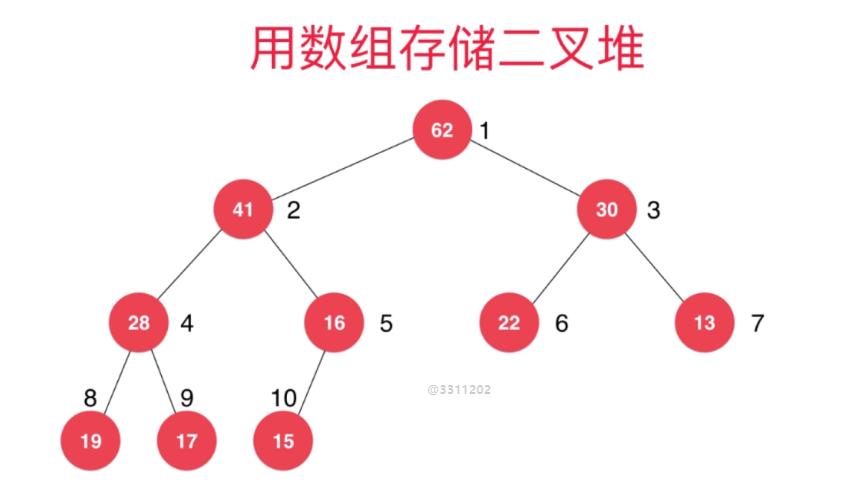

最大堆：父节点大于子节点的二叉堆，**根元素是最大值，这是最大堆最重要的特点**

最小堆：父节点小于子节点的二叉堆

## 4.3 插入元素 Shift Up 

如果要在上图二叉堆中插入一个元素，操作如下

1. 添加元素到数组最后一个位置，索引为count+1
2. 为了维持二叉堆父大于子的性质，比较节点与索引为`(count+1)/2`父节点值的大小
   1. 如果小于父节点值，添加元素操作结束。
   2. 如果大于父节点值，与父节点交换（`Shift Up`），然后重复第2步，继续与父节点比较大小

```java
// 插入元素
public void insert(Item item) {
    assert count + 1 <= capacity;

    data[++count] = item;
    shiftUp(count);
}

// 最大堆核心函数: 上浮操作
public void shiftUp(int i) {
    // 循环与父节点比较, 若父节点大于子节点, 则退出;
    // 若到了根节点,则退出
    while (i > 1 && data[i / 2].compareTo(data[i]) < 0) {
        // 若父节点大于子节点, 则交换
        // 优化点: 参考插入排序, 不交换数值, 不断向下移动子节点, 直到找到最终位置, 赋值插入元素到最终位置即可
        swap(data, i / 2, i);

        // 插入元素移动到i/2位置, 继续与其父节点比较
        i = i / 2;
    }
}

```


## 4.4 取出元素 Shift Down

堆取出元素是取出根节点，操作如下：

1. 将堆索引为count的最后一个元素放到根节点上，count--
2. 为了维持二叉堆父大于子的性质，比较父(根)节点与两个子节点的值大小
   1. 如果大于两个子节点，取出元素操作结束。
   2. 如果不大于两个子节点，父节点与子节点中的较大值交换（`Shift Down`），然后重复第2步，继续与子节点比较大小

```java
// 从最大堆中取出堆顶元素, 即堆中所存储的最大数据
public Item extractMax() {
    assert (count > 0);

    Item item = data[1];

    // 将最后一个元素放在堆顶, 然后shiftDown
    data[1] = data[count--];
    shiftDown(1);
    return item;
}

// 最大堆核心操作: 下沉ShiftDown
private void shiftDown(int i) {
    // 循环与子节点比较, 若不存在子节点, 则退出;
    // 子节点索引为2i, 如果超出范围则不存在子节点
    while (2 * i <= count) {
        // 在此轮循环中,data[i]和data[j]交换位置
        int j = 2 * i;

        // 比较两个子节点大小, 与较大的子节点交换
        if (j + 1 <= count && data[j + 1].compareTo(data[j]) > 0) {

            j++;
            // data[j] 是 data[2*i]和data[2*i+1]中的最大值
        }

        // 如果父节点大于等于两个子节点, 则退出循环
        if (data[i].compareTo(data[j]) >= 0) break;

        // 交换父节点与较大的那个子节点, 继续与子节点比较
        // 优化点: 参考插入排序, 不交换数值, 只移动向上移动子节点, 直到找到最终位置, 赋值最后一个元素到目标位置即可
        swap(data, i, j);
        i = j;
    }
}
```

## 4.5 基础堆排序

堆排序利用的就是最大堆**根元素是最大值**的性质，堆排序过程如下：

1. 将待排序数组插入到堆中，堆自身的ShiftUp操作能够维持最大堆的性质

2. 由于堆顶（根）元素是最大值，取出最大值根元素，堆的ShiftDown操作能保证最大堆根节点最大
3. 重复第2步，直至取出所有元素

```java
public void heapSort(Comparable[] arr) {
    MaxHeap<Comparable> maxHeap = new MaxHeap<>(arr.length);
    // 1. 入堆
    for (int i = 0; i < arr.length; i++) {
        maxHeap.insert(arr[i]);
    }

    // 2. 取堆根元素, 从大到小排序
    for (int i = arr.length - 1; i >= 0; i--) {
        arr[i] = maxHeap.extractMax();
    }
}
```

上面的堆排序需要遍历数组进行入堆操作，由于数组本身就相当于连续存储一个完全二叉树，只需要对这个完全二叉树进行堆化`Heapify`操作，就可以得到一个最大堆。

操作过程:

1. 每个叶子节点可以认为是只有一个元素的最大堆, 首先找到第一个非叶子节点, 索引为count/2
2. 将第一个非叶子节点插入到子节点的堆中, 进行下沉ShiftDown操作
3. 对每一个非叶子节点都进行ShiftDown操作, 最后就能使得所有父元素大于子元素, 完成堆化操作

此处需要一张截图


```java
public MaxHeap(Item[] arr) {
    data = (Item[]) new Comparable[arr.length + 1];
    this.capacity = arr.length;
    // 将数组依次存入堆中
    for (int i = 0; i < arr.length; i++) {
        data[i + 1] = arr[i];
    }
    this.count = arr.length;

    // 堆化Heapify, 使得数组符合最大堆的性质
    // 从第一个非叶子节点count/2开始, 对每个非叶子节点进行ShiftDown操作
    for (int i = count / 2; i >= 1; i--) {
        shiftDown(i);
    }
}
```

利用最大堆的堆化操作，可以轻松实现排序


## 4.6 原地堆排序

前面的堆排序需要额外的空间，需要在堆中开辟内存空间保存全部的数组元素。注意到上一节的堆排序出堆操作后，堆中存储元素是逐渐减少的。

如果可以直接在待排序数组中形成堆，取出的元素放在数组最后一位，这样就不需要额外的空间来进行堆排序了，这种不需要额外空间的排序成为之**原地排序**。

原地堆排序就可以避免开辟额外内存空间，节省资源。

0. 堆元素保存在数组中，最大值为索引为1的根元素V，最后一个元素索引为count的W

1. 交换V与W，此时数组的最大值M在最后一个位置count。等价于上一节中堆取出根元素的操作。
2. 交换到根位置的元素W进行下沉操作后，此时前count-1个元素仍是一个最大堆.
3. 重复1，2两个步骤，直至堆中元素为0，此时数组是一个从小到大排好序的数组

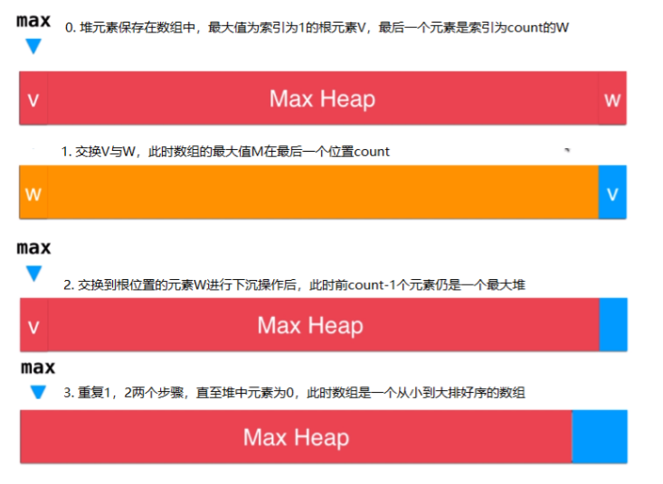


最大堆底层使用数组保存元素，对于从索引0开始存储的元素，节点i的父节点，左子节点和右子节点的计算方式和4.2 章节略有差异，具体如下所示：

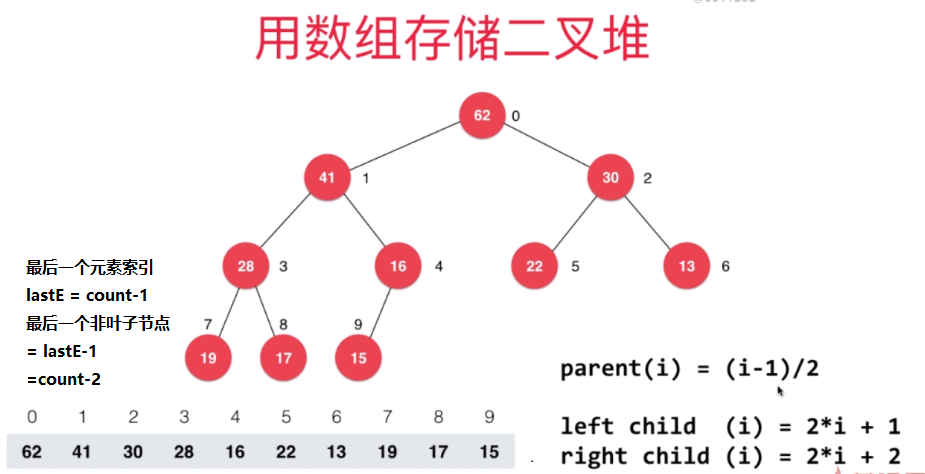


```java

public void heapSort(Comparable[] arr) {
    // 堆化操作， 从最后一个非叶子节点开始
    // 最后一个元素索引为length-1，最后一个非叶子节点开始(length-1-1)/2
    for (int i = (arr.length - 1 - 1) / 2; i >= 0; i--) {
        shiftDown(arr, arr.length, i);
    }
    System.out.println(Arrays.toString(arr));
    // 取出第一个元素, 与末尾元素i交换, 然后对元素i进行下沉操作
    for (int i = arr.length - 1; i > 0; i--) {
        swap(arr, 0, i);
        shiftDown(arr, i, 0);
    }
}


/**
 * @param data
 * @param n    堆元素个数
 * @param i
 */
private void shiftDown(Comparable[] data, int n, int i) {
    // 循环与子节点比较, 若不存在子节点, 则退出;
    // 子节点索引为2i, 如果超出范围则不存在子节点
    while (2 * i + 1 < n) {
        // 在此轮循环中,data[i]和data[j]交换位置
        int j = 2 * i + 1;  //左子节点

        // 比较两个子节点大小, 与较大的子节点交换
        if (j + 1 < n && data[j + 1].compareTo(data[j]) > 0) {

            j++;
            // data[j] 是 data[2*i]和data[2*i+1]中的最大值
        }

        // 如果父节点大于等于两个子节点, 则退出循环
        if (data[i].compareTo(data[j]) >= 0) break;

        // 交换父节点与较大的那个子节点, 继续与子节点比较
        // 优化点: 参考插入排序, 不交换数值, 只移动向上移动子节点, 直到找到最终位置, 赋值最后一个元素到目标位置即可
        swap(data, i, j);
        i = j;
    }
}
```


## 4.7 索引堆

比如一个数组保存的是系统进程的优先级，索引1位置保存的是进程1的优先级。如果对这个数组进行堆化Heapify操作，那么就无法找出进程n的优先级了。可能你会说在每个元素对象中添加一个属性用来保存索引，但是以后查找元素的时间复杂度就变为O(n)了，而数组根据索引查找元素的复杂度是O(1)。

或者数组中保存的是一个大String，交换操作就非常耗时。此时就需要索引堆，即新建一个int数组，只保存元素的索引，然后进行堆化Heapify操作。

如下图所示，data数组中保存**原生的数据**，堆化Heapify就是在index数组中保存元素在data中的索引。比如index[1]就是根元素的索引，两个子节点的索引为index[2]和index[3]。如果要找根元素，首先查找根元素的索引为index[1]=10，所以根元素的值为data[10]=62。

```shell
// 取出最大值根元素, 已知根元素在堆中索引为1
index[1] = 10,
data[index[1]] = data[10] = 62
```


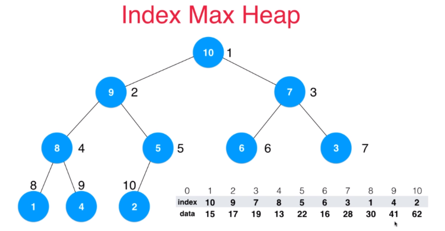

```java
public class IndexMaxHeap<Item extends Comparable> {
    // 存储元素的底层数组
    private Item[] data;
    // 索引堆, 存储堆中每个元素在data数组中的索引
    private int[] indexes;
    private int capacity;
    // 堆中元素个数
    private int count;
```

修改第 i 个元素的值，修改了之后需要对修改的元素进行shiftUp shiftDown操作来维持堆的性质。shift操作是logn级别, 查找索引是n级别，所以change操作最差时间复杂度为O(n) = O(n) + O(logn)。

```java
public void change(int i, Item newItem) {
    i = i + 1;
    data[i] = newItem;

    // 找到data[i]在indexes的位置，
    // data[i]元素的索引为i, 在indexes中找到等于i的元素即可
    for (int j = 1; j <= count; j++) {
        if (indexes[j] == i) {
            shiftUp(j);
            shiftDown(j);
        }
    }
}
```


## 4.8 索引堆的优化

上一章节修改索引堆中元素的操作是O(n)级别的，我们使用**反向查找**的思路来优化change方法。

如下图所示，rev数组中保存了index数据与索引的关系，比如rev第3个位置保存元素7，就是index数组中元素3的索引7。利用空间换时间，将查找过程从O(n)降到了O(1)，shift操作是logn级别，所以change操作最差时间复杂度为O(logn)。

如果我们将data中`第3个`元素19修改为100，那么就需要维护这个元素的`索引3`在index堆中的位置。

```bash
reverse[j] = i
indexes[i] = j
// 修改数组data第3个元素
data[3] = 100
// 维护堆中索引, rev[3]保存的是元素data[3]在index中的位置
index[rev[3]] = 3
// 对index第7个元素进行ShiftDownShiftUp操作, 维护堆的性质
```


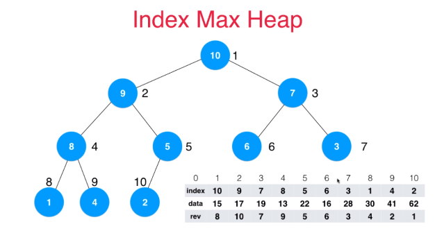


利用空间换时间，将查找过程从O(n)降到了O(1)，shift操作是logn级别，所以change操作最差时间复杂度为O(logn)。代码示例如下：

```java
public void change(int i, Item newItem) {
    i = i + 1;
    data[i] = newItem;

    // 优化: 利用空间换时间, 反向索引O(1)获取修改元素在indexes中的索引
    int j = reverse[i];
    shiftUp(j);
    shiftDown(j);
}
```


## 4.9 使用堆解决问题

第4章开头提出了一个问题，如何在100w个元素中找出最小的100个数。思路如下：

1. 首先我们可以创建一个优先队列，优先队列中维护一个最大堆，保证堆的大小为100，每次插入一个元素E
2. 如果元素E小于堆的最大值根元素，则移除最大值根元素，然后插入元素E（移除和插入元素都由最大堆来保证堆的性质）
3. 等到遍历完100个元素，就找出了最小的100个数。

首先实现一个优先队列

```java
public class PriorityQueue<Item extends Comparable> {
    private MaxHeap<Item> maxHeap;
    public PriorityQueue(int capacity) {
        this.maxHeap = new MaxHeap(capacity);
    }

    public int size() {
        return maxHeap.size();
    }

    public boolean isEmpty() {
        return maxHeap.isEmpty();
    }

    // 获取优先队列第一个元素
    public Item getFront() {
        return maxHeap.getMax();
    }

    // 入队操作
    public void enqueue(Item item) {
        maxHeap.insert(item);
    }

    // 出队操作
    public Item dequeue() {
        return maxHeap.extractMax();
    }
}

```

然后使用优先队列解决N个数中找到最小的N个数问题，使用了我们自己利用最大堆定义的优先队列，代码如下所示：

```java
public static ArrayList<Integer> selectMin(int[] arr, int m) {
    PriorityQueue<Integer> queue = new PriorityQueue<>(m);
    for (int i = 0; i < arr.length; i++) {
        // 前m个元素填充优先队列
        if (i < m) {
            queue.enqueue(arr[i]);
        } else if (arr[i] < queue.getFront()) {
            // 遍历的元素小于优先队列最大值, 将队列最大值出队, 加入新元素
            // 如果小于优先队列最大值, 则忽略
            queue.dequeue();
            queue.enqueue(arr[i]);
        }
    }

    // 队列中存储了最小的m个元素
    ArrayList<Integer> mins = new ArrayList();
    while (!queue.isEmpty()) {
        mins.add(queue.dequeue());
    }
    return mins;
}
```


## 4.10 Java中的PriorityQueue

上一节使用了自己定义的优先队列PriorityQueue，其实在Java中有自带的PriorityQueue更加强大，我们使用PriorityQueue来尝试解决Leetcode中的问题。

[347. 前 K 个高频元素](https://leetcode-cn.com/problems/top-k-frequent-elements/)

给定一个非空的整数数组，返回其中出现频率前 **k** 高的元素。

**示例 1:**

```
输入: nums = [1,1,1,2,2,3], k = 2
输出: [1,2]
```

**示例 2:**

```
输入: nums = [1], k = 1
输出: [1]
```

**说明：**

- 你可以假设给定的 *k* 总是合理的，且 1 ≤ k ≤ 数组中不相同的元素的个数。
- 你的算法的时间复杂度**必须**优于 O(*n* log *n*) , *n* 是数组的大小。


```java
public class Solution5 {

    public List<Integer> topKFrequent(int[] nums, int k) {

        TreeMap<Integer, Integer> map = new TreeMap<>();
        for(int num: nums){
            if(map.containsKey(num))
                map.put(num, map.get(num) + 1);
            else
                map.put(num, 1);
        }

        PriorityQueue<Integer> pq = new PriorityQueue<>(
                (a, b) -> map.get(a) - map.get(b)
            );
        for(int key: map.keySet()){
            if(pq.size() < k)
                pq.add(key);
            else if(map.get(key) > map.get(pq.peek())){
                pq.remove();
                pq.add(key);
            }
        }

        LinkedList<Integer> res = new LinkedList<>();
        while(!pq.isEmpty())
            res.add(pq.remove());
        return res;
    }

    private static void printList(List<Integer> nums){
        for(Integer num: nums)
            System.out.print(num + " ");
        System.out.println();
    }

    public static void main(String[] args) {

        int[] nums = {1, 1, 1, 2, 2, 3};
        int k = 2;
        printList((new Solution()).topKFrequent(nums, k));
    }
}
```

## 4.11 排序算法总结

### 4.11.1 常见排序算法对比

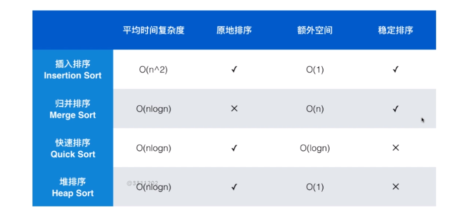

**平均时间复杂度：**代表算法的平均时间复杂度水平。

​	比如插入排序对于有序数据，可以达到O(n)级别

​	对于普通的快排，有序数据会使快排退化到O(n^2)，我们随机选择基准值就是为了解决该问题。

**原地排序**：指在排序过程中不申请多余的存储空间，**只利用原来存储待排数据的存储空间进行比较和交换的数据排序**。

​	比如归并排序必须开辟额外的空间完成归并的过程。

**额外空间：**完成排序算法需要的额外内存空间。

​	插入排序和堆排序都是直接在数组上交换数据就能完成排序，所以需要的额外空间为O(1)。

​	归并排序每层递归需要的空间为 O(n)，递归需要的栈空间是 O(logn)，二者相加仍为 O(n)

```java
private void merge(Integer[] arr, Integer left, int mid, Integer right) {
    // 拷贝数组arr[l...r], temp长度为r-l+1, arr[l]对应到temp[0]的位置	
    Integer[] temp = Arrays.copyOfRange(arr, left, right + 1);
    // 然后将temp左右部分元素比较后填充到原数组arr
```

​	快速排序虽然是原地排序，但是也需要额外 O(logn) 的空间，这是因为快排使用递归，共需要递归 logn 次，因此也需要 logn 的栈空间来保存每次递归过程中的临时变量。

**稳定排序：**对于相等的元素，在排序后，原来靠前的元素依然靠前，**相等元素的相对位置没有发生改变。**

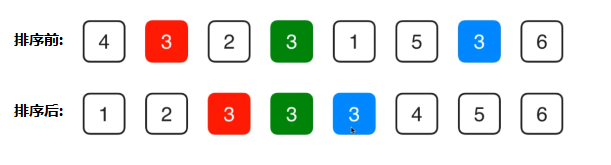

​	插入排序是稳定排序，元素与有序部分的元素进行比较，小于才交换，**等于大于**不交换，所以不会改变相等元素的相对位置。

​	归并排序也是稳定排序，左序列元素小于等于右序列元素时，左序列元素填充到原数组。

```java
// 比较两部分的第一个元素, 小的元素填充到原数组中, 并且索引右移
// 等于的元素也是左半部分先填充, 为了满足稳定排序的要求
if (temp[p1 - left] <= temp[p2 - left]) {
    arr[i] = temp[p1 - left];
    p1++;
} else{...}
```

​	快速排序不是稳定排序，比如选择基准值，必然破坏与基准值相等的元素与基准值的相对位置。比如都是1的数组使用快排，无论随机选择，使用第一个元素做基准值，都会破坏稳定性。

​	堆排序不是稳定排序，将数组堆化Heapify的过程中，也有可能破坏这个相对位置。

###4.11.2 快排与归并排序的选择

经过上面的分析，快排和归并排序都是O(nlogn) 级别的排序算法，快排的优点是占用额外空间小，缺点是不是稳定排序，而归并排序恰好与之相反。

Java 认为使用原始类型 int 则表示内存敏感，对于原始类型，因为没有与值相等不同的身份概念，所以不需要稳定排序，因此选择快排，`Arrays.sort(int[] arr)`也使用快排。

使用对象则表示内存不敏感，但是对象具有与值相等不同的身份概念，比如分数相等的两个学生对象并不能完全替换，所以需要稳定排序，因此原则归并排序，`Arrays.sort(Object[] arr)`也使用归并排序或 Timsort。


###4.11.3 自定义比较函数

**可以通过自定义比较函数，让排序算法不存在稳定性的问题**。比如 Student 对象默认按照 id 进行排名，现在需要按照 score 进行排名，但使用快排不具有稳定性，我们可以自定义比较函数，当学生 score 相同时比较 id，就可以使得快排具有稳定性了。

```java
@Override
public int compareTo(Student student) {
    if(this.score == student.score) {
        return this.id.compareTo(student.id);
    }
    return this.score - student.score;
}
```

​	可以看出，**自定义比较函数是需要找出数据当前的排序规则，保证稳定性其实就是维持这个规则**。当 score 相等时学生的排名规则就是 id，当分数相等时比较 id，自然就可以使得相等元素的相对位置不发生改变

​	


###4.11.4 assert知识补充

assert

Java中assert默认关闭，需要vm options 中添加命令`-enableassertions`开启才会生效，fasle时抛出AssertionError错误。assert 一般用于private方法，用于检测参数等操作。assert不能替代if卫语句， 


# 待补充

Java默认快排DualPrivotQuickSort

自底向上的归并排序，优化归并排序空间

希尔排序及其优化

冒泡排序及其优化

TimSort

桶排序

计数排序等

leetcode

根据极客时间完善


# 5 二分搜索树

# 6 并查集

# 7 图论

# 8 最小生成树

# 9 最短路径


# 参考文档与推荐阅读

1. [算法与数据结构 - 慕课网liuyubo](https://coding.imooc.com/lesson/425.html)
2. [示例代码仓库 - github](https://github.com/maoturing/sort-algorithms)
3. [十大排序算法动画解析 - 五分钟学算法](https://mp.weixin.qq.com/s/vn3KiV-ez79FmbZ36SX9lg)
4. [什么是冒泡排序 - 程序员小灰](https://mp.weixin.qq.com/s?src=11&timestamp=1582475237&ver=2176&signature=NBGK5eVg0TU5oDSzkEt5ekKURq3qXFPgOXtTBkooeMevjdEgyC7y1Dc7OouomaxT2DqowxTc6bOiLszELt0GEGK9n*XJM-OKlBFjCIjh1nVyboVWIq-8UJALq-JdmgzF&new=1)
5. [什么是归并排序 - 程序员小灰](https://mp.weixin.qq.com/s/885uGVhlffWAxjgIEW-TiA)
6. [图解快速排序 - 五分钟学算法](https://mp.weixin.qq.com/s?src=11&timestamp=1581998618&ver=2165&signature=4siKuJkvdXHAvzi250f3A3A0tNwcM7YN0*x-PKukp6PkNiqE5s3-1G725SPVbOzeQgRG4hLxEgnQVnQfeMjVaSWnC34vVEcd*3bs9KIc9ia7ExeumeHW0MqGg6XWEj*2&new=1)
7. [玩转 Java 快速排序 - 掘金](https://juejin.im/post/5b55660ee51d4519202e2003)
8. [Java源码中的DualPivotQuicksort](https://mp.weixin.qq.com/s/5Oy-tBPDTakRUT6D2UKx2Q)
9. [Dual-Pivot QuickSort 阅读笔记](https://www.jianshu.com/p/2c6f79e8ce6e)
10. [Java源码阅读-DualPivotQuicksort](https://zongwenlong.github.io/2017/01/06/Java-SourceCode-Sort/)
11. [Dual-Pivot Quicksort algorithm - Vladimir Yaroslavskiy](https://codeblab.com/wp-content/uploads/2009/09/DualPivotQuicksort.pdf)
12. [DualPivotQuickSort 双轴快排源码笔记 - 于晓飞](https://www.jianshu.com/p/6d26d525bb96)
13. [JDK1.8源码分析-timsort](https://www.cnblogs.com/warehouse/p/9342279.html)