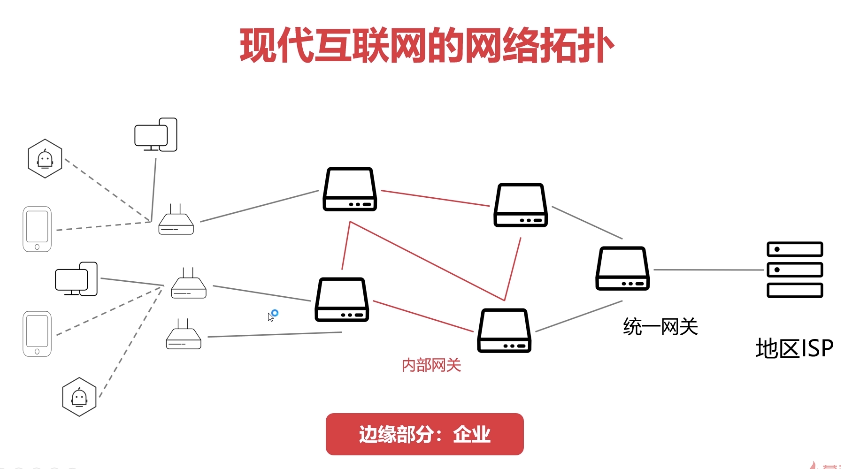

# 网络

TCP/IP四层网络模型

- 数据链路层 - 以太网协议
- 网络层 - IP 协议
- 传输层 - TCP协议
- 应用层 - HTTP 协议

OSI 七层网络模型

- 应用层
- 表示层
- 会话层
- 传输层
- 网络层
- 数据链路层
- 物理层


## 1.1 物理层

 电脑之间需要联网，都需要插一根网线，美国与中国联网是海底的光缆，这里的光缆与网线都属于物理层，将各个电脑连接起来，形成一个网络，这就是物理层的含义，物理层负责传输 0 和 1 的电路信号。

 

## 1.2 数据链路层

> 物理层将各个电脑连接起来了，还传输 0 和 1 的电路信号，但是这些 01 的含义和规则并没有统一规定，很多年前，各个公司都定义自己的电路信号规则，为了互联互通，就诞生了**以太网协议**。

一组 01 电路信号是一个数据包，叫一个帧 (frame) ，每个帧分成两个部分，标头(head) 和数据(data) ，标头包含一些说明性的东西，比如发送者，接受者，数据类型之类。

以太网协议规定，接入网络的所有设备，都必须有一个网卡，以太网协议里的数据包，在数据链路层传输的数据包，必须从一个电脑的网卡，传输到另一个电脑的网卡，而这个网卡的唯一标识就是 mac 地址。每块网卡出厂的时候，就有一个全球唯一的 mac 地址，48 bit 即 12 位 16进制数表示，前 6 位是网卡厂商编号，后 6 为是网卡流水号。

在 windows 中，`ipconfig /all`可以查看物理地址，就是 mac地址

```cmd
C:\Users\trac>ipconfig /all

# VMware 的虚拟网卡
以太网适配器 VMware Network Adapter VMnet1:
   描述. . . . . . . . . . . . . . . : VMware Virtual Ethernet Adapter for VMnet1
   物理地址. . . . . . . . . . . . . : 00-50-56-C0-00-01
   IPv4 地址 . . . . . . . . . . . . : 192.168.253.1(首选)

# VMware 的虚拟网卡
以太网适配器 VMware Network Adapter VMnet8:
   描述. . . . . . . . . . . . . . . : VMware Virtual Ethernet Adapter for VMnet8
   物理地址. . . . . . . . . . . . . : 00-50-56-C0-00-08
   IPv4 地址 . . . . . . . . . . . . : 192.168.252.1(首选)

# 电脑上的真网卡
以太网适配器 以太网:
   描述. . . . . . . . . . . . . . . : Intel(R) Ethernet Connection (7) I219-V
   物理地址. . . . . . . . . . . . . : 30-9C-23-E8-C1-7E
   IPv4 地址 . . . . . . . . . . . . : 192.168.1.107(首选)

# Hyper-V 的虚拟网卡
以太网适配器 vEthernet (Default Switch):
   描述. . . . . . . . . . . . . . . : Hyper-V Virtual Ethernet Adapter
   物理地址. . . . . . . . . . . . . : 00-15-5D-D5-CA-E6
   IPv4 地址 . . . . . . . . . . . . : 172.27.128.1(首选)

```


通过去网站 https://mac.51240.com 查询这些网卡，电脑上的物理网卡厂商是 Micro_Star 微星，与电脑主板的厂商一致，Hyper-V 的虚拟网卡的厂商是 Microsoft 微软，VMware 的虚拟网卡的厂商是 VMware。


在以太网中传输数据包时，必须指定接受者的 mac 地址才能传输数据。


以太网的数据包从一个 mac 地址发送到另一个 mac 地址并不是精准推送的。如果一个电脑发一个数据包出去，会广播给局域网内的所有电脑设备的网卡，然后每台电脑都从数据包里获取接收者 mac地址，跟自己的 mac 地址进行对比，如果一致，则说明是发送给自己的数据包。


上面这种广播的方式，仅仅针对一个子网（局域网）内的电脑进行广播，当然也不可能广播给所有电脑的网卡。


## 1.3 网络层

> 通过以太网发送数据包，会广播给子网（局域网）内所有电脑，那么如何知道哪些电脑是在一个子网（局域网）内呢？另外在世界范围内，不可能通过广播的方式，从千万计的电脑里找到目标 MAC地址的电脑而不超时，此时就得依靠 ip 协议

这就得依靠网络层，有一套 ip 地址，ip地址就可以让我们区分哪些电脑是一个子网的。

网络层里有 **ip 协议**，ip 协议定义的地址就是 ip 地址。 ip 地址有 ipv4 和 ipv6 两个版本，目前广泛使用的 ipv4，由 32 位 bit 组成，一般用 4 个十进制数字表示，范围从 0.0.0.0 到 255.255.255.255 。

每台计算机，都会分配一个 ip 地址，ip 地址的前 3 个数字，代表了子网，后 1 个数字表示子网内的电脑。如果几台电脑是一个子网的，那么前面的 3 个数字是一样的。(这里只是举例)

准确的来说，判断是否为一个子网，是将 ip 地址与子网掩码进行与运算，如果结果相等，则说明在同一个子网。

将下面的设备的 ip 地址与子网掩码做与运算，可得所在的子网是 `192.168.1.0`，如果其他设备的计算结果也是`192.168.1.0`，则说明在一个子网中，可以通过广播的方式使用以太网协议向这台电脑发送数据包

```
IPv4 地址 . . . . . . . . . . . . : 192.168.1.107
子网掩码  . . . . . . . . . . . . : 255.255.255.0
默认网关. . . . . . . . . . . . . : 192.168.1.1
```


但是如果发现接收者不在当前子网内，那么就不能通过广播来发送数据包，则将数据包发送到默认网关（路由器）通过路由器来发送数据包。路由器负责将多个子网进行连接，比如家里的路由器，其实就是将家里的子网发送的数据包路由到你要访问网站的所在子网，进行通信。当然，路由器的一次转发，可能并不能直接找到要访问网站的子网，经过多次转发后，若当前路由器ip 与访问网站ip 在一个子网内，则说明找到了目标子网，然后将数据包广播给当前子网内的所有网卡设备。（路由器的转发规则是什么？）

举个例子，一个快递从美国洛杉矶发出，要发给中国浙江杭州市A小区X先生，快递公司需要将快递多次转发，从洛杉矶 -> 纽约 -> 北京 -> 杭州 -> A小区，根据邮编指定转发路线，然后到了 A 小区之后，就可以用广播的形式，快递员大喊一声 “X先生取快递了”，虽然小区内所有人都听到了快递员的喊声，但只有 X 先生会收取快递并打开确认。


网关其实就是路由器的一种，运作在网络层，大家可以把路由器上的 ip 地址认为是网关，路由器其实是工作在网络层的设备。我们使用`ipconfig`就可以看到**默认网关**，就是路由器的 ip 地址（一般为 `192.168.1.1`），是子网与外网连接的设备。

交换机时工作在数据链路层的，通过 mac 地址来寻址和传输数据包的，主要用在局域网内的通信，一般你假设一个局域网，里面的电脑通信就是通过数据链路层发送数据包，通过mac地址来广播的，广播就是通过交换机这个设备来吧数据广播到局域网内的其他机器上。

路由器是工作在网络层的，通过 ip 地址寻址和传输数据包的，一般用于连接英特网。

LAN local area network 是局域网，WAN wide area network 是广域网，WLAN wireless area network 是无线局域网，也就是 wifi，在局域网内，可以通过 wifi 无线联网。

家里的路由器包含了交换机和路由的两个功能，如果是与局域网的内的设备连接，就把网线插在 LAN 端口，如果是与因特网连接，就把网线插在 WAN 端口。


## 1.4 传输层

> 通过 ip 协议解决了跨局域网的通信问题，但是在一台电脑上，有多个程序使用一个网卡进行通信，那么如何区分不同程序的数据呢？

这的依靠端口，发送一个数据包到指定电脑（ip）的一个网卡的某个端口，然后这台电脑中会有程序来监听这个端口，如 Tomcat 监听 8080，即使用端口来区分不同程序的数据包。端口范围是`[0~65535]`，其中`[0~1023]`被系统占用。


- 数据链路层，基于以太网协议，进行局域网内的寻址与通信；

- 网络层，基于 ip 协议，进行夸局域网的寻址与通信；
- 传输层，基于 tcp 协议，通过端口来区分不同程序的通信数据。

传输层的 tcp协议，仅仅只是规定了一套基于端口的点对点通信协议，包括如何建立连接，如何发送和读取消息，但是实际上如果要基于 tcp 协议来开发，一般是用 socket，java socket 网络编程。


我们使用浏览器访问`https://www.baidu.com/`，通过浏览器控制台可以看到百度的 ip 地址为`14.215.177.38:443`，其中 `443` 端口是 HTTPS 的默认端口。然后使用`netstat -ano`查看端口的占用情况，可以看到本机是进程`10900`使用`63223`端口访问的百度，`ESTABLISHED`表示双方已经建议了连接。然后查找该进程，果然是我们的浏览器进程。

```cmd
C:\Users\mao> netstat -ano | findstr "443"
协议    本地地址                外部地址                 状态             PID
TCP    192.168.1.107:63223    14.215.177.38:443      ESTABLISHED     10900

C:\Users\mao>tasklist | findstr "10900"
QQBrowser.exe                10900 Console                    1    205,232 K
```

经过上述步骤，我们也可以知道，浏览器的每一个标签页其实就是一个进程，都会分配一个端口，基于 TCP 协议来与互联网进行通信。


然后我们启动一个 Web 项目，访问端口设置为 9000，即进程 9180 正在监听 9000端口，此时外部地址为 `0.0.0.0:0 `，说明没有人与当前端口建立网络连接，再去查一下 9180 进程，恰好是我们的 java 进程。

```cmd
C:\Users\mao>netstat -ano | findstr "9000"
协议    本地地址                外部地址                 状态             PID
TCP    0.0.0.0:9000           0.0.0.0:0              LISTENING       9180
TCP    [::]:9000              [::]:0                 LISTENING       9180
```


然后使用浏览器访问 `localhost:9000`，进程 9180 使用 9000 端口与外部地址 [::1]:49474 建立了连接，状态为 ESTABLISHED；进程 10900 使用 49474 端口与外部地址 [::1]:9000 建立了连接，说人话就是本机的 java进程9180 使用  9000 端口与浏览器进程 10900 端口建立了连接。为什么会建立两条连接呢？

```cmd
C:\Users\mao>netstat -ano | findstr "9000"
协议    本地地址                外部地址                 状态             PID
TCP    0.0.0.0:9000           0.0.0.0:0              LISTENING       9180
TCP    [::]:9000              [::]:0                 LISTENING       9180
TCP    [::1]:9000             [::1]:49474            ESTABLISHED     9180
TCP    [::1]:9000             [::1]:49547            ESTABLISHED     9180
TCP    [::1]:49474            [::1]:9000             ESTABLISHED     10900
TCP    [::1]:49475            [::1]:9000             TIME_WAIT       0
TCP    [::1]:49547            [::1]:9000             ESTABLISHED     10900
```


然后再使用浏览器访问`192.168.1.107:9000`，也会访问到前面的 web项目，可以看到本机的 java进程9180 使用  9000 端口与浏览器进程 8084 使用49740端口建立了连接。

```cmd
C:\Users\mao>netstat -ano | findstr "9000"
协议    本地地址                外部地址                 状态             PID
TCP    0.0.0.0:9000           0.0.0.0:0              LISTENING       9180
TCP    192.168.1.107:9000     192.168.1.107:49740    ESTABLISHED     9180
TCP    192.168.1.107:49740    192.168.1.107:9000     ESTABLISHED     8084
```


TCP 的三次握手与四次挥手参考《码出高效》1.5章节。


## 1.5 应用层

> 通过传输层的 tcp 协议可以传输数据，接收到数据后，怎么解析？比如邮件如何发送如何解析，网页如何请求如何解析，针对不同的数据类型，需要定义不同的应用层协议。

HTTP 协议就是网页传输的协议，`GET http://localhost:8080?k1=v1&k2=v2  http-1.1` ，返回 200 ，说明访问成功。以上其实就是 HTTP 协议。


**HTTP 请求**


**HTTP请求状态行**

请求行由请求`Method`, `URL` 字段和`HTTP Version`三部分构成, 总的来说请求行就是定义了本次请求的请求方式, 请求的地址, 以及所遵循的HTTP协议版本例如：

```
GET /example.html HTTP/1.1 (CRLF)
```


消息报头由一系列的键值对组成，允许客户端向服务器端发送一些附加信息或者客户端自身的信息，主要包括


**HTTP响应**

​	

HTTP响应也由三部分组成，包括状态行，消息报头，响应正文。

状态行也由三部分组成，包括HTTP协议的版本，状态码，以及对状态码的文本描述。例如：

```text
HTTP/1.1 200 OK (CRLF)
```


**HTTP的五大特点**

1. 支持**客户/服务器**模式。
2. **简单快速**：客户向服务器请求服务时，只需传送请求方法和路径。请求方法常用的有`GET`、`HEAD`、`POST`。每种方法规定了客户与服务器联系的类型不同。由于`HTTP`协议简单，使得`HTTP`服务器的程序规模小，因而通信速度很快。
3. **灵活**：HTTP允许传输任意类型的数据对象。正在传输的类型由`Content-Type`加以标记。
4. **无连接**：无连接的含义是限制每次连接只处理一个请求。服务器处理完客户的请求，并收到客户的应答后，即断开连接。采用这种方式可以节省传输时间。早期这么做的原因是请求资源少，追求快。后来通过`Connection: Keep-Alive`实现长连接
5. **无状态**：`HTTP`协议是无状态协议。无状态是指协议对于事务处理没有记忆能力。缺少状态意味着如果后续处理需要前面的信息，则它必须重传，这样可能导致每次连接传送的数据量增大。另一方面，在服务器不需要先前信息时它的应答就较快。


### 1.5.1 HTTP 长链接

现在访问一次网页往往包含多个请求，包括js，css，图片和后端请求，如果都使用短连接，每个资源的获取都需要三次握手和四次挥手，性能会很差，在 HTTP1.1 时可以使用长链接，底层就是是 TCP 长链接。


### 1.5.2 HTTPS 

参考码农翻身


# 参考文档

1. [Java工程师面试突击第三季 - 中华石杉](https://www.bilibili.com/video/BV1WE411p7yH?p=44)
2. [操作系统与网络 - 慕课网](https://coding.imooc.com/class/355.html) 
3. [网络是怎样连接的](https://book.douban.com/subject/26941639/) 
4. [netstat -ano 查看机器端口占用情况](https://www.cnblogs.com/cmt/p/14553189.html)
5. [码出高效 1.5 TCP/IP]()
6. [趣谈网络协议](https://time.geekbang.org/column/intro/100007101)


2021年3月25日12:00:52

后面根据参考文档补充网络部分的笔记。





